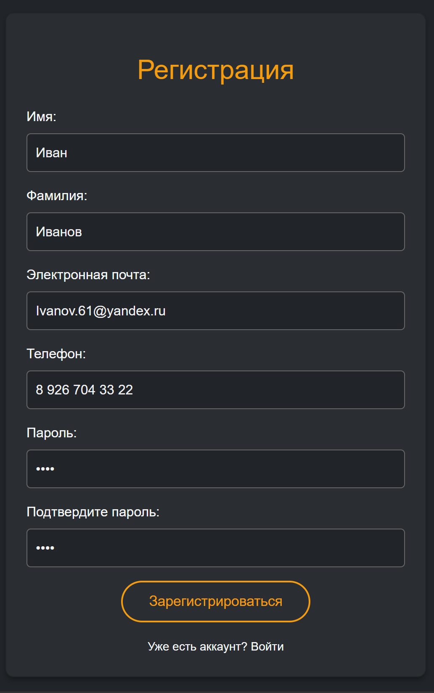
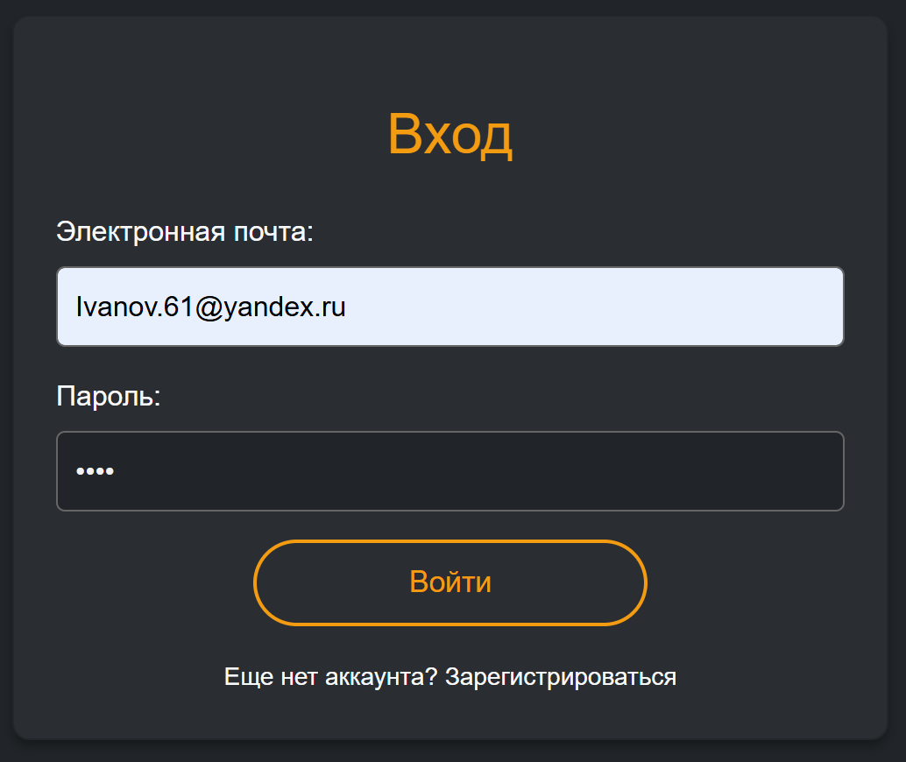
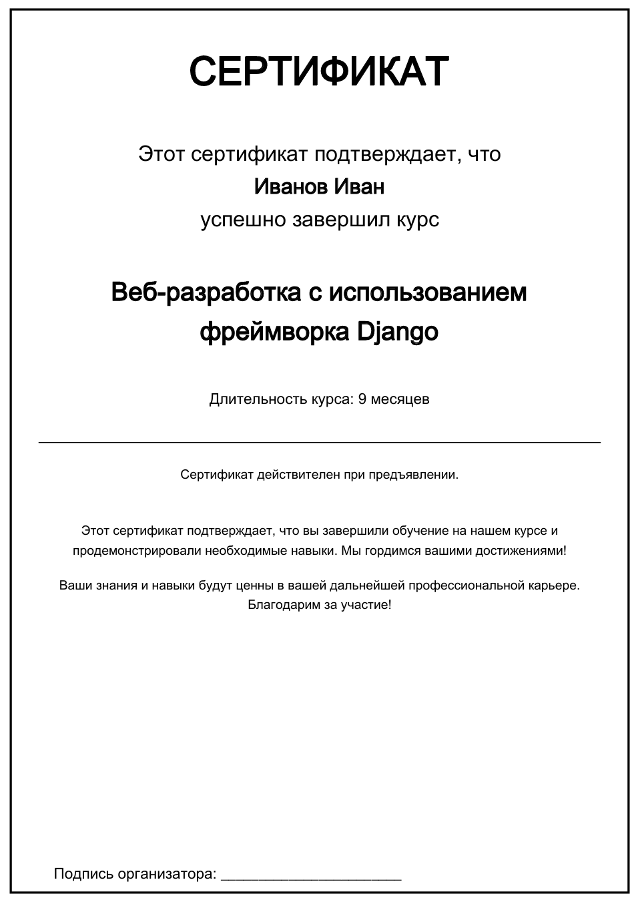

## Добро пожаловать на EduLab!

A group of novice developers (Crab) is creating a special educational system **EduLab** that helps students improve their knowledge, open their minds, and develop their imagination!

### Состав команды:
- Мазуров Никита
- Михалькевич Владислав
- Яковлева Алёна

## EduLab

Автоматизированная система **EduLab** предназначена для создания и проведения онлайн-курсов с удобным функционалом для студентов и преподавателей. Система позволяет преподавателям создавать курсы, загружать лекции в разных форматах, а учащимся – проходить обучение и получать обратную связь в виде сертификатов.

---

## Пользовательская документация EduLab

Мы надеемся, что вы сможете получить наилучший пользовательский опыт при использовании нашего ресурса! Для этого приводим пользовательскую документацию ниже.

### Для учеников:
- [Регистрация/авторизация](#регистрацияавторизация)
- [Личный кабинет](#личный-кабинет)
- [Список курсов](#список-курсов)
- [Запись на курс и его краткое описание](#запись-на-курс-и-его-краткое-описание)
- [Прохождение курса](#прохождение-курса)
- [Получение сертификата](#получение-сертификата)

### Для преподавателей:
- [Личный кабинет преподавателя](#личный-кабинет-преподавателя)
- [Работа с курсом](#работа-с-курсом)

### Для администратора:
- [Панель администратора](#панель-администратора)

---

## Регистрация/авторизация

Для использования ресурса необходимо создать личный кабинет пользователя, заполнив форму регистрации.Если у вас уже есть личный кабинет, то перейдите к этапу авторизации. На рисунке 1 показан пример заполнения формы регистрации.

Далее необходимо авторизироваться. Для этого заполняется форма авторизации, как показано на рисунке 2.

---

## Личный кабинет

После авторизации происходит переход на страницу личного кабинета, где можно просмотреть личные данные пользователя и список курсов, на которые вы записаны, как показано на рисунке 3.

В случае если вы решили выйти из своего личного кабинета, воспользуйтесь кнопкой  **«Выйти»**. Для просмотра всех доступных крусов нажмите кнопку **«Все курсы»**.

---

## Список курсов

На данной странице представлены все курсы, которые доступные пользователям на данный момент, как показано на рисунке 4.

Каждый курс представлен в виде карточки с названием и продолжительностью курса. Для записи на курс и просмотра более подробной информации о конкретном курсе необходимо нажать кнопку **«Подробнее»**. Для возвращения в личный кабинет пользователя воспользуйтесь кнопкой **«Мои курсы»**.

---

## Запись на курс и его краткое описание

При нажатии на кнопку **«Подробнее»** происходит переход на страницу с кратким описанием курса, также внизу расположена кнопка **«Записаться на курс»**, как показано на рисунке 5.

После записи на курс происходит переход в личный кабинет пользователя, где можно увидеть выбранный курс в списке курсов пользователя, как показано на рисунке 6.

В списке курсов пользователя отображается карточка с добавленным курсом. На карточке присутсвует название курса, его краткое описание и шкала прохождения курса.

---

## Прохождение курса

Для прохождения курса необходимо в личном кабинете пользователя нажать на карточку курса в списке курсов. После этого появится списко уроков курса, как показано на рисунке 7.

ДДля лучшего усвоения материала уроки рекомендуется проходить по порядку, но в случе, если вы уже знаете тему и чувствуете, что справитесь без повторения, то можете выбрать следующий урок. Для проходжения урока, просто нажмите на соотвествующий урок, тогда произойдёт переход к материалам урока, как показано на рисунке 8.

Для подтверждения прохождения урока необходимо нажать кнопку **«Урок пройден»**, кторая расположена в конце каждого урока, как показано на рисунке 9.

Пройденные уроки помечаются галочками в списке уроков курса, как представлено на рисунке 10.

Также прогресс прохождения курса наглядно отображается в шкале прохождения курса в списке курсов пользователя в личном кабинете. После прохождения всех уроков появится возможность скачать сертификат о прохождении курса, как показано на рисунке 11.

---

## Получение сертификата

Для получения сертификата о прохождении курса сначала необходимо пройти курс, после этого в личном кабинете пользователя в списке курсов появится кнопка **«Скачать сертификат»**. При нажатии на эту кнопку автоматически начнётся скачивание сертификата в формате pdf. По завершению процесса, в браузере отобразится новый загруженный файл, как показано на рисунке 12.

Далее, вы можете просмотреть серитификат на вашем персональном устройстве, как показано на рисунке 13.

---

# Для преподавателей

Для получения прав преподавателя необходимо обратиться к администратору. Администратор имеет возможность назначить роль пользователю - Преподаватель. Тогда данный пользователь сможет использовать EduLab как преподаватель.

## Личный кабинет преподавателя

Личный кабинет преподавателя несколько отличается от личного кабинета пользователя-ученика, изначально он выглядит, как показано на рисунке 14.

Изначально в личном кабинете преподавателя нет курсов. Чтобы они появились администратор должен назначить преподавтеля на курс. После этого личный кабинет преподавателя изменится, как показано на рисунке 15.

---

## Работа с курсом

Для того чтобы редактировать курс необходимо нажать на карточку соответсвующего курса в личном кабинете преподавателя. Далее появится возможность добавлять уроки в выбранном курсе, как показано на рисунке 16.

Для создания нового урока воспользуйтесь кнопкой **«Создать новый урок»**. После этого появятся инструменты для создания урока, как показано на рисунке 17.

Уроку можно назначить название, добавить блоки, которые будут содержать материалы урока, а также можно сохранить урок. Для добавления блока необходимо нажать на значок "плюса". После этого появится форма для создания блока, как показано на рисунке 18.

Тип блока может быть разным: текст, фото, видео, как показано на рисунке 19.

Для того чтобы вставить изображение и или видео необходимо ввести ссылку на ресурс, как показано на рисунке 20.

После добавления всех необходимых блоков нужно сохранить урок. После этого он появится в списке уроков курса, как показано на рисунке 21.

Слева у урока есть кнопка **«Удалить»**. Чтобы ей воспользоваться обратитесь к администратору, он должен перевести курс в состояние неактивности. Также урок можно редактировать, для этого нужно просто нажать на урок в списке уроков курса. После добавления урока его могут просмотреть все ученики, которые записались на этот курс, как показано на рисунке 22.

---

## Панель администратора

Панель администратора предоставляет доступ к основным функциям управления платформой, включая управление пользователями и курсами. Для использования панели администратора войдите в систему с учетной записью администратора. Панель обладает двумя основными функциональностями: 
1) Управление пользователями: Просмотр списка пользователей, изменение их ролей и статусов.
2) Управление курсами: Создание, редактирование и удаление курсов.
Функции показаны на рисунке 23. 

При нажатии на **«Управление курсами»** откроется список всех курсов, как представлено на рисунке 24.

Как видно, каждый курс можно редактировать и удалять, кроме этого можено создать новый курс. Для этого нужно воспользоваться кнопкой **«Добавить курс»**. Тогда откроется форма создания курса, как показано на рисунке 25. 

Обратите внимание на статус курса. Если он неактивный, то ученики не смогут записаться на курс, а преподавтели получат возможност удалять уроки курса. Далее, для получения возможности управления пользователями на панели выберите **«Управление пользователями»**, тогда отобразится список всез пользоватлей, как показано на рисунке 26.

Для изменения информации о пользователе нажмите на соответствующую кнопку рядом с его именем. Для создания нового пользователя нажмите **«Создать нового пользователя»**. Тогда откроется форма создания пользователя, как представлено на рисунке 27.

---

Советы: 

1)Регулярно проверяйте активность пользователей для обеспечения безопасности.

2)При создании курсов предоставляйте подробную информацию для привлечения студентов

© 2025 Crab Dev Team
